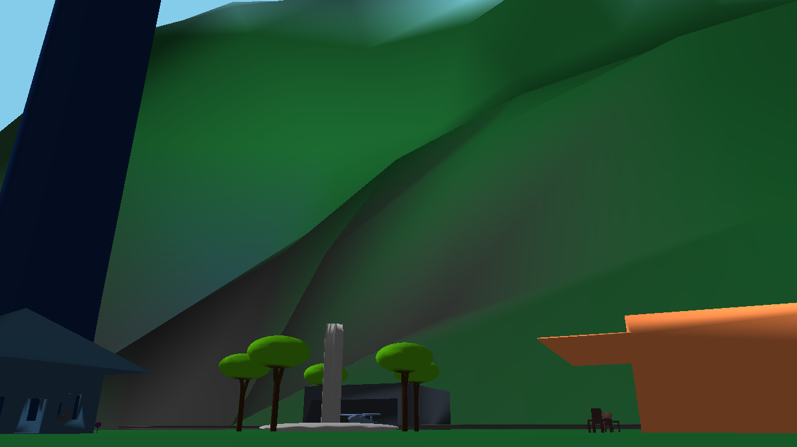

# Cyberspace
A 3D renderer written in C using OpenGL and GLFW, ported to tbe web and capable of running natively.

[Click here to access a live demo!](https://ashtheamin.github.io/

How this program works:
- It loads a mesh that is made up of vertex positions, vertex colours and faces and displays them on the screen.

- It takes vertex positions and using transformation matricies such as the view, model and projection matricies to position each object in the correct position in the world, then draws the faces after passing them into the GPU.

Capabilities:
- This program is capable of loading in meshes and displaying them
- It is also capable of lighting and handling normals.
- It runs on the Web as well via Emscripten
- It can load multiple objects/meshes, with varying sizes, rotations and position attributes, though this demo only loads one

Controls: 
- This program is controlled using the WASD to change the camera's position, and the mouse cursor to change the pitch and yaw of the camera for navigation.
- The Q to U keys can be used to change the speed of the camera for navigation.

The scene:
- I created the scene myself, using OpenSCAD and SculptGL, both open source 3D modelling tools.
- I had to convert models manually to a list of vertex positions, normals, colours and faces to a plain format the program can easily interpret since assimp cannot be easily ported to the web.
- I use the libassimp tool to convert .ply files to this plain text format that is easy for the program to parse even on the web

This program:
- This program is licensed under the MIT license.
